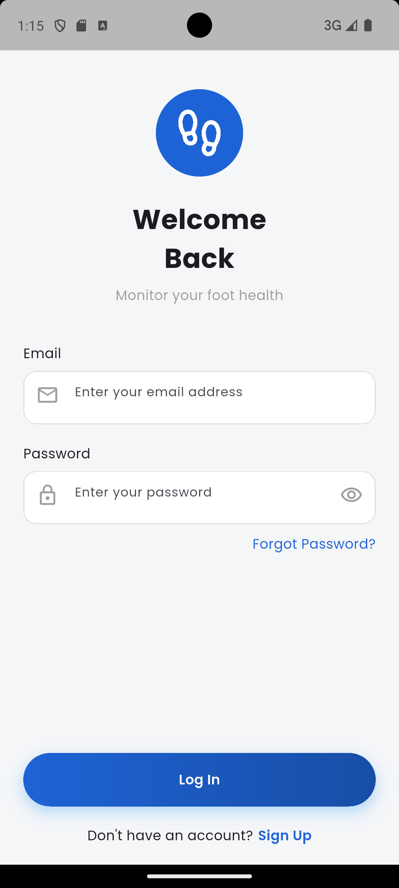
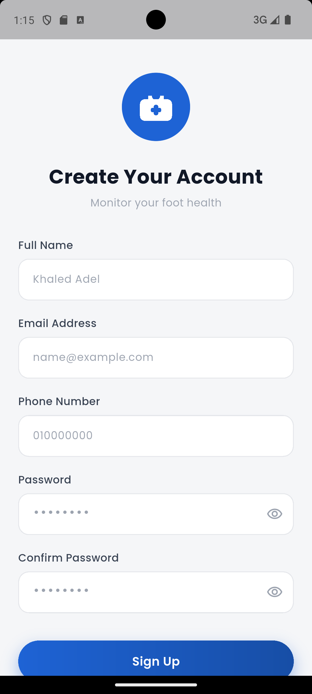
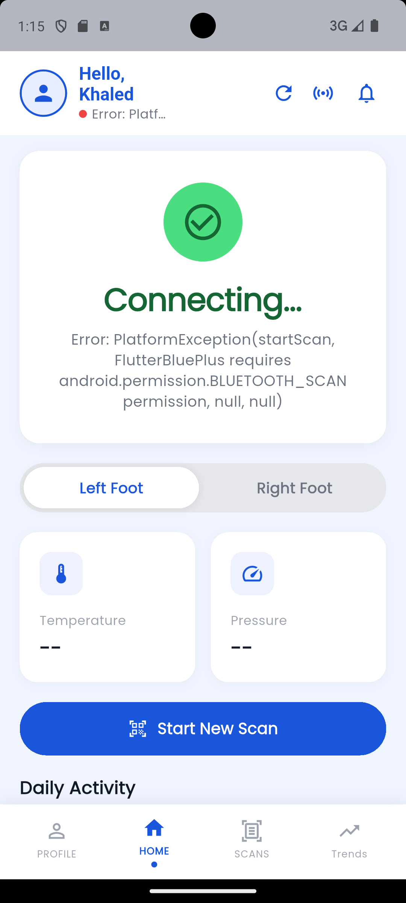
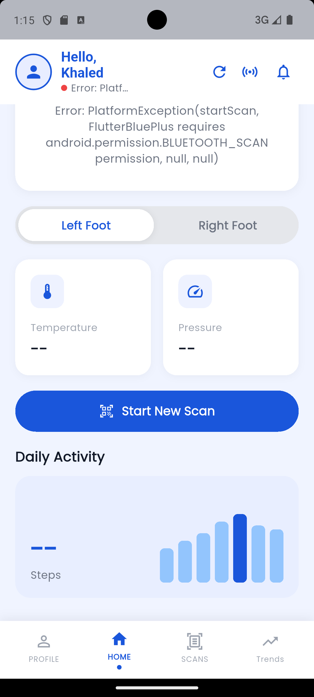
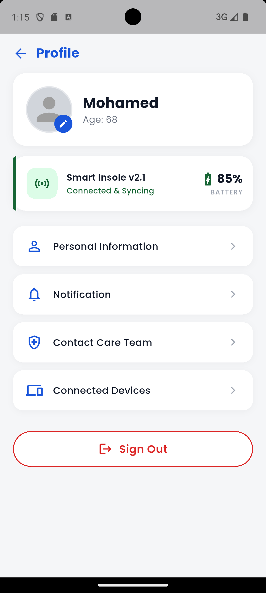
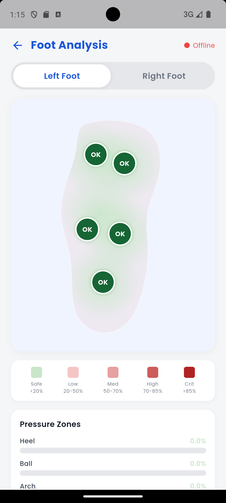
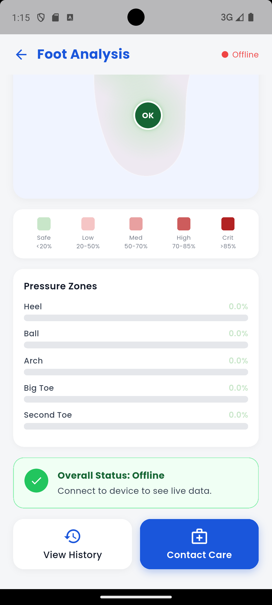
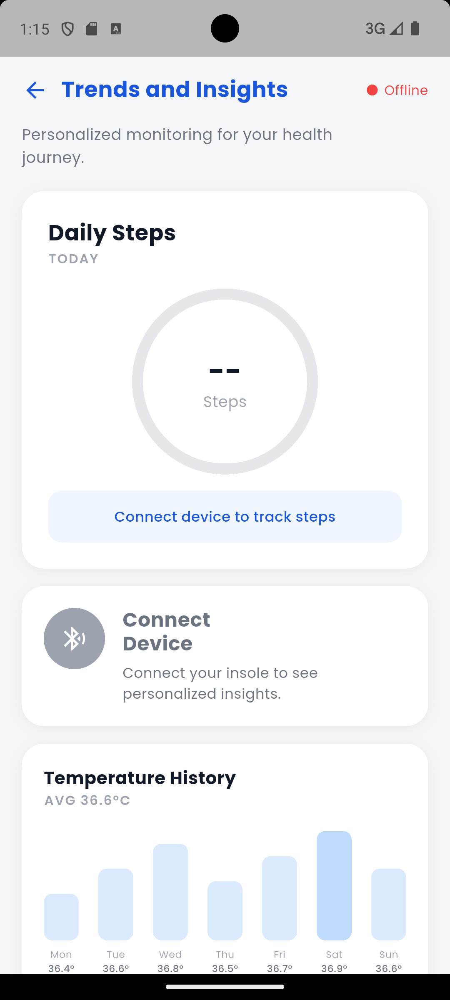
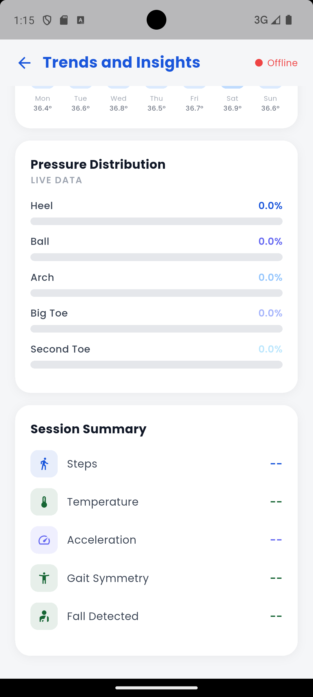
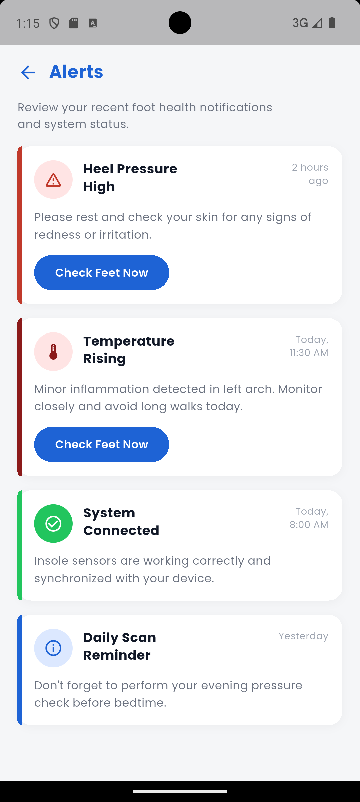

# 🦶 Diebtix — Smart Insole for Diabetic Foot Monitoring

A smart insole system that monitors foot health for diabetic patients in real-time.

## 📱 App Screenshots

| Login | Sign Up |
|-------|---------|
|  |  |

| Home | Home Scrolled |
|------|---------------|
|  |  |

| Foot Heatmap | Pressure Zones |
|--------------|----------------|
|  |  |

| Trends | Trends Scrolled |
|--------|-----------------|
|  |  |

| Profile | Alerts |
|---------|--------|
|  |  |

## ⚙️ Hardware
- ESP32 microcontroller
- 5x FSR pressure sensors
- MPU-6050 IMU (accelerometer + gyroscope)
- MAX6675 thermocouple (temperature)
- Bluetooth Low Energy (BLE) connectivity

## 📲 Mobile App (Flutter)
- Real-time BLE data streaming
- Dynamic foot pressure heat map
- Gait symmetry analysis
- Fall detection alerts
- Temperature & pressure trends screen

## 🛠️ Tech Stack
- **Firmware:** ESP32 / Arduino (C++)
- **Mobile:** Flutter / Dart
- **Communication:** BLE (Nordic UART)
- **Platform:** Android

## 👨‍💻 Developer
Khaled Adel — Biomedical Engineering, Mansoura University
